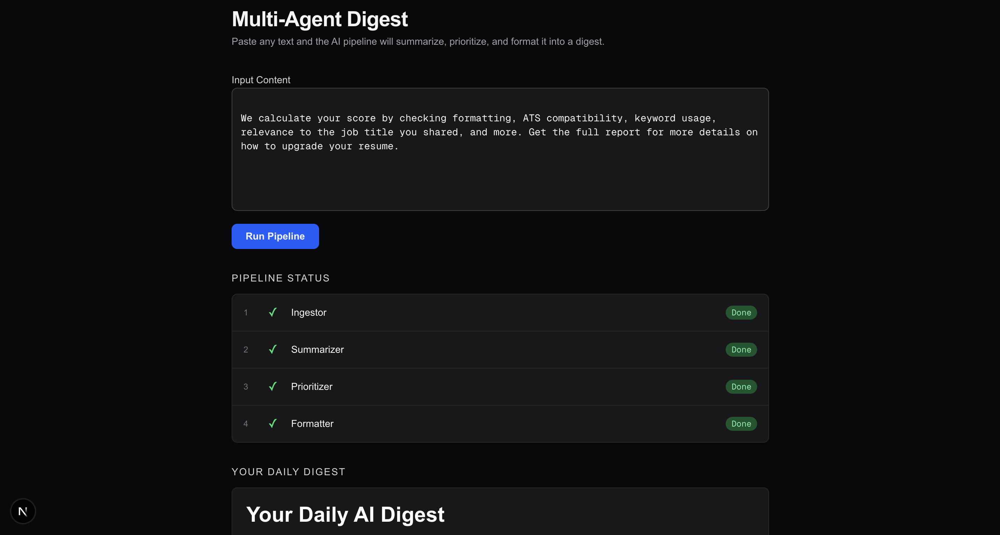

# Multi-Agent AI Digest System

A fully containerized multi-agent pipeline that transforms raw text into a structured, prioritized daily digest — powered by OpenAI and orchestrated with Docker Compose.



---

## What It Does

Paste any block of text — articles, notes, reports, updates — and the system routes it through four specialized AI agents in sequence:

| Step | Agent | Role |
|------|-------|------|
| 1 | **Ingestor** | Reads raw input files and consolidates them into a single document |
| 2 | **Summarizer** | Calls the OpenAI API (GPT-4o-mini) to condense the content into key bullet points |
| 3 | **Prioritizer** | Scores each insight by urgency using keyword analysis and reorders by priority |
| 4 | **Formatter** | Renders the final output as a clean markdown digest with date and priority labels |

Each agent runs as an isolated Docker container. The pipeline is sequential — each agent waits for the previous one to complete successfully before starting.

---

## Project Structure

```
multi-agent-digest/
├── agents/
│   ├── ingestor/          # Reads from data/input/, writes data/ingested.txt
│   ├── summarizer/        # Calls OpenAI API, writes data/summary.txt
│   ├── prioritizer/       # Scores and sorts insights, writes data/prioritized.txt
│   └── formatter/         # Renders final digest to output/daily_digest.md
├── api/
│   └── main.py            # FastAPI backend: /run, /status, /output endpoints
├── frontend/              # Next.js dashboard (React + Tailwind CSS)
├── data/                  # Shared volume between agents (gitignored)
├── output/                # Final digest output (gitignored)
├── docker-compose.yml     # Orchestrates all four agent containers
└── start.sh               # One-command startup script
```

---

## Prerequisites

- [Docker Desktop](https://www.docker.com/products/docker-desktop/) (running)
- Python 3.10+
- Node.js 18+
- An OpenAI API key

---

## Setup

**1. Clone the repo**
```bash
git clone https://github.com/Tsehla-Motjolopane-official/Multi-Agent-AI-System.git
cd Multi-Agent-AI-System
```

**2. Set your OpenAI API key**
```bash
echo "OPENAI_API_KEY=sk-your-key-here" > .env
```

**3. Install backend dependencies**
```bash
pip3 install -r api/requirements.txt
```

**4. Install frontend dependencies**
```bash
cd frontend && npm install && cd ..
```

---

## Running the App

```bash
./start.sh
```

This starts both servers:

| Service | URL |
|---------|-----|
| Dashboard | http://localhost:3000 |
| API (with docs) | http://localhost:8000/docs |

---

## Using the Dashboard

1. Open **http://localhost:3000** in your browser
2. Paste any text into the input field
3. Click **Run Pipeline**
4. Watch each agent complete in real time — Ingestor → Summarizer → Prioritizer → Formatter
5. Your digest appears below once the pipeline finishes
6. Click **Download .md** to save the result

---

## API Endpoints

| Method | Endpoint | Description |
|--------|----------|-------------|
| `POST` | `/run` | Start the pipeline with `{ "content": "..." }` |
| `GET` | `/status` | Poll live status of each agent container |
| `GET` | `/output` | Retrieve the final digest content |
| `GET` | `/health` | Health check |

---

## How the Pipeline Works

```
Input text
    │
    ▼
[Ingestor]  ── writes ──▶  data/ingested.txt
    │
    ▼
[Summarizer]  ── OpenAI ──▶  data/summary.txt
    │
    ▼
[Prioritizer]  ── scores ──▶  data/prioritized.txt
    │
    ▼
[Formatter]  ── renders ──▶  output/daily_digest.md
```

The frontend polls `/status` every 1.5 seconds to reflect each container's state (`pending` → `running` → `done`), and fetches `/output` once the formatter completes.

---

## Tech Stack

- **Agents**: Python 3, OpenAI SDK
- **Orchestration**: Docker Compose
- **Backend API**: FastAPI + Uvicorn
- **Frontend**: Next.js 16, React 19, Tailwind CSS v4
- **Container management**: Docker Python SDK
